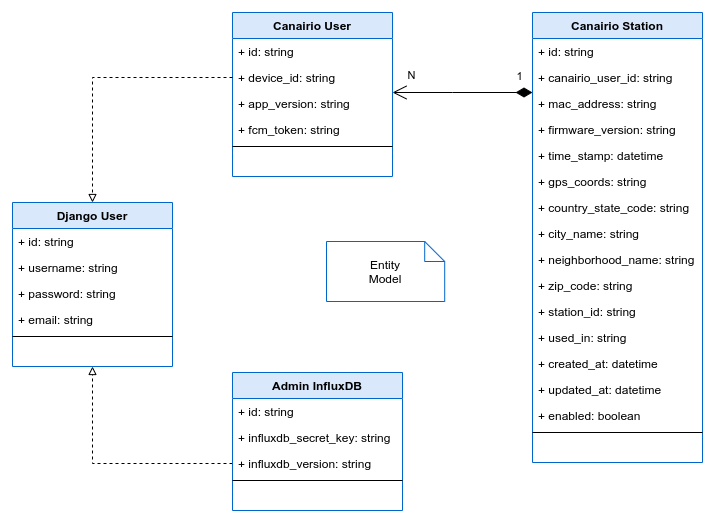

# canairio-services

CanAirIO Services

**Entity Model**:

[](./doc/Canairio-Services-Entities.png)

---

> Work in progress ...

## Create New Django App

```bash
# Linux terminal run
python manage.py startapp {app_name}
```

### Setup API Settings

For each New Django App you will need to add it within the INSTALLED_APPS, check the api/settings/base.py file:

```bash
# api/settings/base.py update file
INSTALLED_APPS = [
    '...',
    '{app_name}',
]
```

### Setup New Django App Serializers and URLs

Within each New Django App:

- [1] Create the serializers.py file, this file contains the Model Serializer.
- [2] Create the urls.py file, this file contains the urlpatterns.

```bash
# Inside api/{app_name} New Django App run:
# [1] Create the serializers.py file
touch serializers.py
# [2] Create the urls.py file
touch urls.py
```

- **Serializers:**

Read Serializer documentation: [here](https://www.django-rest-framework.org/api-guide/serializers/#serializers)

```python
# Update the api/{app_name}/serializers.py file
from rest_framework import serializers

# Create your serializers here.

# Example:
class {AppName}Serializer(serializers.ModelSerializer):

    class Meta:
        model = {AppName}
        fields = ['id', 'something', 'etc', ...]
```

- **URLs:**

```python
# Update the api/{app_name}/urls.py file
# The Django project also has a urls.py file.
# Add a reference to your application's urls.py file.
# Add the URL patterns.

from django.urls import path

from . import views

urlpatterns = [
    # Example:
    path('v1/{app_name}/example', views.{AppName}ExampleView.as_view(), name='{app_name}-example'),
    ...
]
```

### Setup New Django App Views

Within each New Django App:

- Update the views.py file
- Import the APIView from rest_framework.views
- Read Class-based Views (Class-based Views) documentation: [here](https://www.django-rest-framework.org/tutorial/3-class-based-views/)

```python
# Update the api/{app_name}/views.py file
from rest_framework.views import APIView
from rest_framework.response import Response
from rest_framework import status

# Create your views here.

# Example:
class AppNameExampleView(APIView):
    """
    Retrieve, create, update or delete an {app_name} instance.
    """
    def get(self, request):
        # TODO: Something
        # return Response(serializer.data, status=status.HTTP_200_OK)

    def post(self, request):
        # TODO: Something
        # return Response(serializer.data, status=status.HTTP_200_OK)

    def put(self, request):
        # TODO: Something
        # return Response(serializer.data, status=status.HTTP_200_OK)

    def delete(self, request):
        # TODO: Something
        # return Response(serializer.data, status=status.HTTP_200_OK)
```

### Setup API URLs

For each new Django App you will need to include the URLs reference within urlpatterns, check the api/urls.py file:

```python
# Update the api/urls.py file
urlpatterns = [
    ...
    path('api/', include('{app_name}.urls')),
]
```

### Postman API Documentation

Read and review the CanAirIO Services API Documentation in Postman:

[CanAirIO Services API Documentation](https://documenter.getpostman.com/view/2374715/TVCjx6Ba)
