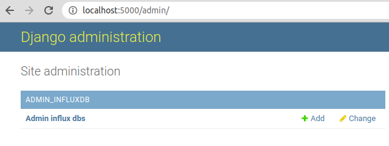
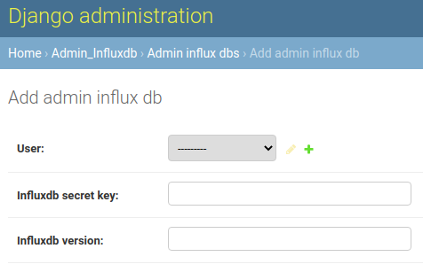

# Get Started with CanAirIO Services

CanAirIO Services `Project Description Here`

---

> Work in progress ...

**TODO:**

- [ ] Add Project Description
- [ ] Add About the Project
- [ ] Add Introduction
- [x] ~~Requirements~~
- [x] ~~Create and Setup Virtual Environment~~
- [x] ~~Install Requeriments~~
- [x] ~~Setup Environment Variables~~
- [x] ~~Run the Project Locally~~
- [x] ~~Create Admin User~~
- [x] ~~Login Django Admin Site~~
- [x] ~~Create InfluxDB User~~
- [x] ~~Postman API Documentation~~
- [ ] Run Automated Testing with Postman
- [ ] Getting Started Video

---

## About the Project

`About the Project Here`

## Introduction

`Introduction Here`

## Requirements

In order to run the project locally, you will need the following requeriments:

* Linux Debian/Ubuntu, Ubuntu 18.04.5 LTS^
* Python 3.8^
* curl 7.58.0^
* libpq-dev
* Heroku CLI

## Create and Setup Virtual Environment

Run the instructions below in a terminal to create and setup the Python virtual environment:

```bash
# Linux terminal
python -m venv .venv
source .venv/bin/activate
```

## Install Requeriments

* PostgreSQL library

```bash
# Linux terminal
sudo apt install libpq-dev
```

* Heroku CLI

```bash
# Linux terminal
curl https://cli-assets.heroku.com/install.sh | sh
```

* Python project requirements

```bash
# Linux terminal
pip install -r requirements.txt
```

## Setup Environment Variables

```bash
# Linux terminal
cp -fv example.env .env
```

After copy the example.env file to .env you can edit and change the values in the .env file, by default you can use the same file.

## Run the Project Locally

Now the project is available to run locally, running a terminal:

```bash
# Run the app locally
heroku local web
```

## Create Admin User

Django Admin Site needs an Admin User,
read the documentation [here](https://docs.djangoproject.com/en/3.0/intro/tutorial02/#creating-an-admin-user)

```bash
# Within api/ folder run in a terminal
python manage.py createsuperuser
# ---
Username: sebaxtian
Email address: sebaxtian@example.com
Password: **********
Password (again): *********
Superuser created successfully.
```

Remember this admin user will be used by the Django Admin Site.

## Login Django Admin Site

Open the browser and go to:

> [http://localhost:5000/admin](http://localhost:5000/admin)

Use the Admin username and password to Login into the Django Admin Site.

[](./Login-Admin-Site.png)

## Create InfluxDB User

In order to create and get Tokens that will be used by request to the InfluxDB API with authorization, you need register the InfluxDB user using the Admin Site.

[](./Admin-Site-0.png)

Please, check the right `Influxdb secret key` in your InfluxDB configuration file instance.

Read the InfluxDB configuration file documentation [here](https://docs.influxdata.com/influxdb/v1.8/administration/config/#using-the-configuration-file)

For local development you can use the InfluxDB Sandbox [here](https://github.com/influxdata/sandbox)

[](./Admin-Site-1.png)

## Postman API Documentation

Read and review the CanAirIO Services API Documentation in Postman:

[CanAirIO Services API Documentation](https://documenter.getpostman.com/view/2374715/TVCjx6Ba)

## Run Automated Testing with Postman

`Run Automated Testing with Postman Here`

## Getting Started Video

`Getting Started Video Here`
